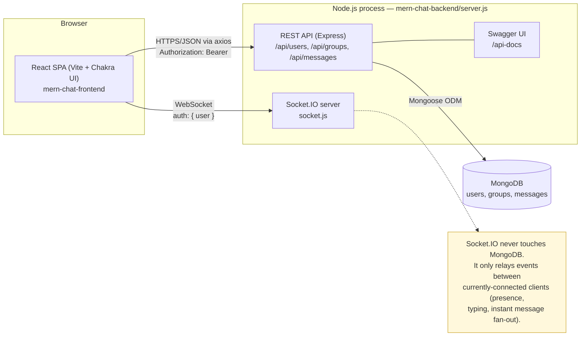
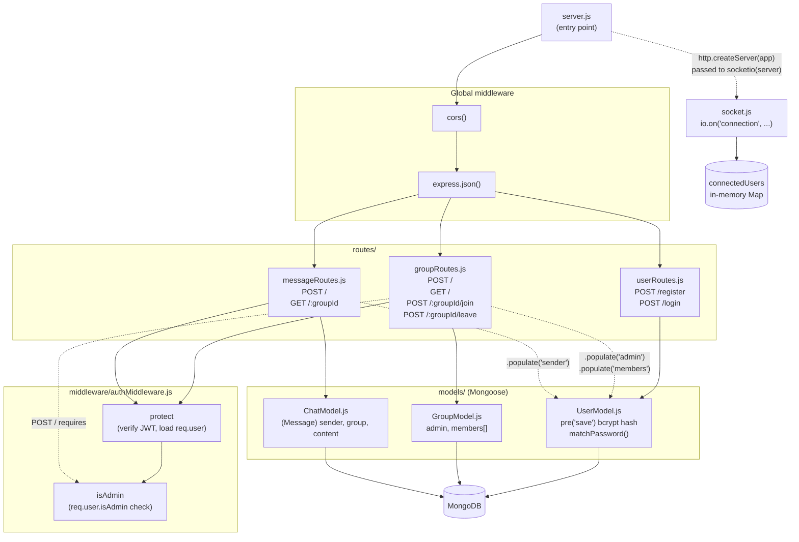
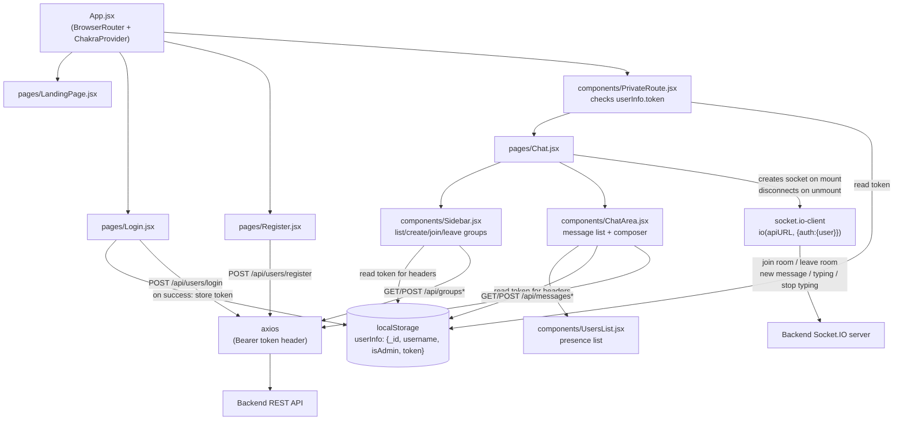

# Architecture Diagrams

This doc gives two views of the system, at two different zoom levels:

- **High-level** — the major pieces (browser, API, real-time layer, database) and
  how they talk to each other. Good for a first-time reader or a project overview slide.
- **Low-level** — inside each piece: modules, middleware order, and which file
  calls which. Good for someone about to change code.

Pair this with [REQUIREMENTS.md](./REQUIREMENTS.md) (functional/non-functional
requirements + ER diagram) and the [sequence diagrams](./sequence%20diagrams)
(step-by-step traces of individual flows like login or send-message).

## 1. High-level architecture

**Key points:**

- Two transports, one server process: REST (`server.js` + `routes/`) is the
  source of truth — it's the only thing that reads/writes MongoDB. Socket.IO
  (`socket.js`) is a stateless-on-disk broadcast layer for real-time UX
  (presence, typing indicators, instant delivery). A client still calls
  `POST /api/messages` to persist a message and separately emits
  `new message` over the socket so other connected members see it instantly.
- Auth is JWT-based: `POST /api/users/login` issues a token, the SPA stores it
  in `localStorage` (`userInfo.token`) and attaches it as a Bearer header on
  protected REST calls, and passes the user object as Socket.IO handshake
  `auth` (not JWT-verified on the socket side — see NFR table in
  REQUIREMENTS.md).
- CORS on both the Express app and the Socket.IO server is scoped to the
  known frontend origin, not `*`.

## 2. Low-level design — backend

**Request pipeline, in order (`server.js`):** `cors()` → `express.json()` →
route-specific `protect` (JWT) → route-specific `isAdmin` → handler → Mongoose
model → response. `userRoutes` has no `protect`, since register/login must be
reachable while unauthenticated.

**socket.js event handlers** (all keyed by `socket.id` in `connectedUsers`):
`join room` (joins the Socket.IO room, updates the map, emits `users in room`
+ `notification`), `leave room` / `disconnect` (removes from the map, emits
`user left`), `new message` (pure relay via `socket.to(groupId).emit(...)`,
no DB write), `typing` / `stop typing` (relay only).

## 3. Low-level design — frontend

**Notes:**

- `utils.js` exports `apiURL` (`VITE_API_URL` env var, falling back to
  `http://localhost:5000`) — the single place both `axios` calls and the
  Socket.IO client get the backend origin from.
- Auth state isn't in a React Context — components read `userInfo` directly
  from `localStorage` on demand (`JSON.parse(localStorage.getItem("userInfo"))`).
  `PrivateRoute` gates the `/chat` route; there's no route-level protection
  beyond that (e.g. no redirect-if-already-logged-in on `/login`).
- `Chat.jsx` owns the single Socket.IO connection for the session and passes
  it down as a prop to `ChatArea`; `Sidebar` and `ChatArea` never construct
  a socket themselves.
