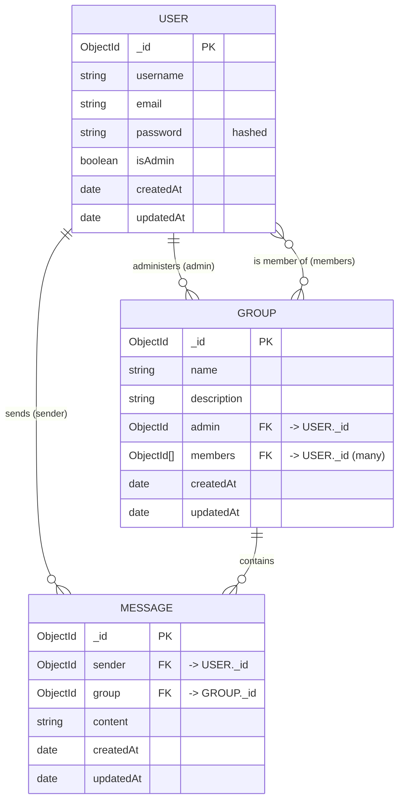

# Requirements & ER Modeling

This doc covers two things every project should define before (or alongside) writing
code: **requirements** (what the system must do, and how well it must do it) and the
**ER model** (what data it manages, and how that data relates). Both are illustrated
using this MERN Chat App as the running example.

## 1. Functional Requirements (FR)

A functional requirement describes **what the system does** — a specific behavior or
feature triggered by a user action or API call. Written as "The system shall ...".

| ID    | Requirement                                                                 | Implemented in                                  |
| ----- | ---------------------------------------------------------------------------- | ------------------------------------------------ |
| FR-1  | The system shall allow a new user to register with a username, email, and password. | `POST /api/users/register` ([userRoutes.js](../routes/userRoutes.js)) |
| FR-2  | The system shall reject registration if the email is already in use.        | `userRoutes.js` — `User.findOne({ email })` check |
| FR-3  | The system shall hash passwords before storing them; passwords are never stored in plain text. | `UserModel.js` pre-save hook (bcrypt) |
| FR-4  | The system shall authenticate a user by email/password and issue a JWT on success. | `POST /api/users/login` |
| FR-5  | The system shall restrict group creation to admin users.                    | `POST /api/groups` (`protect`, `isAdmin` middleware) |
| FR-6  | The system shall allow any authenticated user to list all groups.           | `GET /api/groups` |
| FR-7  | The system shall allow a user to join a group they are not already a member of. | `POST /api/groups/:groupId/join` |
| FR-8  | The system shall allow a user to leave a group they are a member of.        | `POST /api/groups/:groupId/leave` |
| FR-9  | The system shall allow an authenticated user to send a message to a group.  | `POST /api/messages` |
| FR-10 | The system shall return a group's message history ordered oldest-first.     | `GET /api/messages/:groupId` |
| FR-11 | The system shall broadcast new messages to other members of a group in real time. | `socket.js` — `new message` / `message received` |
| FR-12 | The system shall notify group members in real time when a user joins or leaves. | `socket.js` — `join room` / `leave room` / `notification` |
| FR-13 | The system shall show which users are currently present in a group.         | `socket.js` — `users in room` |
| FR-14 | The system shall show typing indicators to other members of a group.       | `socket.js` — `typing` / `stop typing` |

## 2. Non-Functional Requirements (NFR)

A non-functional requirement describes **how well** the system does it — a quality
attribute or constraint, not a feature. Written as "The system shall be ...".
Unlike FRs, NFRs are usually not satisfied by a single line of code — they're
properties that emerge from many decisions across the codebase.

| Category            | Requirement                                                                                     | Where it shows up |
| -------------------- | ------------------------------------------------------------------------------------------------ | ------------------ |
| **Security**          | Passwords must be hashed (never stored/transmitted in plain text).                              | bcrypt in `UserModel.js` |
| **Security**          | Protected routes must reject requests without a valid JWT.                                      | `protect` middleware |
| **Security**          | Admin-only actions must reject non-admin users even if authenticated.                           | `isAdmin` middleware |
| **Security**          | Cross-origin requests must be limited to known frontend origins, not `*`.                       | CORS config in `server.js` |
| **Availability**      | The API must depend on a reachable database; connection failures should log clearly, not crash silently. | `mongoose.connect().catch(...)` in `server.js` |
| **Scalability**       | Real-time presence state is held in an in-memory `Map` per Node process — this does **not** scale across multiple server instances without a shared store (e.g. Redis adapter for Socket.IO). | `connectedUsers` in `socket.js` |
| **Performance**       | Message history should be retrievable in a single query, sorted server-side rather than client-side. | `.sort({ createdAt: 1 })` in `messageRoutes.js` |
| **Usability/Docs**    | The API must be self-documenting for other developers/consumers.                                | Swagger UI at `/api-docs` |
| **Maintainability**   | Schema and business rules should live close to the model (e.g. password hashing in the model, not scattered in controllers). | Mongoose `pre("save")` hooks |

## 3. ER Modeling Technique

Entity-Relationship (ER) modeling is a way to describe data **before** deciding how to
store it — independent of SQL vs NoSQL. The technique has three building blocks:

- **Entity** — a "thing" the system needs to remember (e.g. `User`, `Group`, `Message`).
- **Attribute** — a property of an entity (e.g. `User.email`).
- **Relationship** — how entities connect, with a **cardinality**:
  - `1–1` one to one
  - `1–N` one to many
  - `M–N` many to many

The general steps:
1. List the entities (nouns in your requirements — see the FR table above: user, group, message).
2. List each entity's attributes and pick a primary key (in MongoDB, `_id`).
3. Identify relationships between entities and their cardinality.
4. Decide, for each relationship, how it will physically be represented — this is
   where MongoDB modeling differs from relational modeling (see §4 below).

### ER diagram for this app

This matches the actual Mongoose schemas: [UserModel.js](../models/UserModel.js),
[GroupModel.js](../models/GroupModel.js), [ChatModel.js](../models/ChatModel.js)
(the `Message` model).

### 4. Applying ER modeling to MongoDB: reference vs. embed

Relational databases resolve every relationship into foreign keys and join tables.
MongoDB gives you a second option per relationship: **embed** the related data
directly in the parent document, or **reference** it by `_id` and `.populate()` it
(same as this project does everywhere via `ref: "User"` / `ref: "Group"`).

| Relationship               | Cardinality | This project's choice | Why |
| --------------------------- | ----------- | ---------------------- | --- |
| `Group.admin` → `User`      | 1–N         | Reference (`ObjectId`) | A user document shouldn't be duplicated/rewritten every time their profile changes. |
| `Group.members` → `User`    | M–N         | Reference (array of `ObjectId`) | Many groups share the same users; embedding would duplicate user data across every group. |
| `Message.sender` → `User`   | 1–N         | Reference              | Same reason — one user, many messages, don't duplicate the user doc per message. |
| `Message.group` → `Group`   | 1–N         | Reference              | A group can have thousands of messages; embedding messages inside the group document would make it unbounded and slow to load. |

Rule of thumb used here: **reference when the "many" side is unbounded or the
referenced entity is reused elsewhere**; embed when the child data is small, bounded,
and only ever makes sense nested inside its one parent (e.g. an `address` object
embedded directly in a `User`, which this schema doesn't need).
